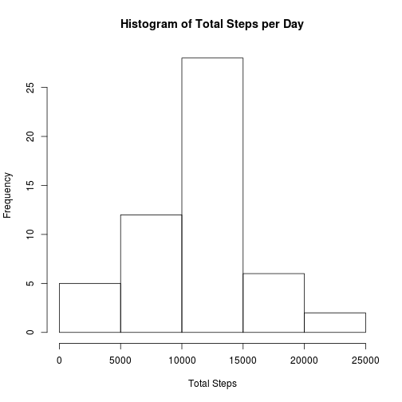
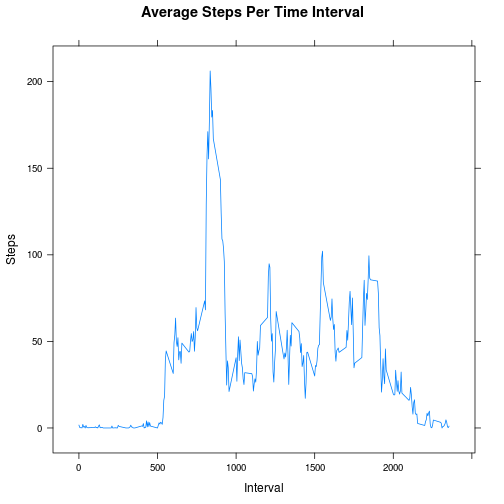
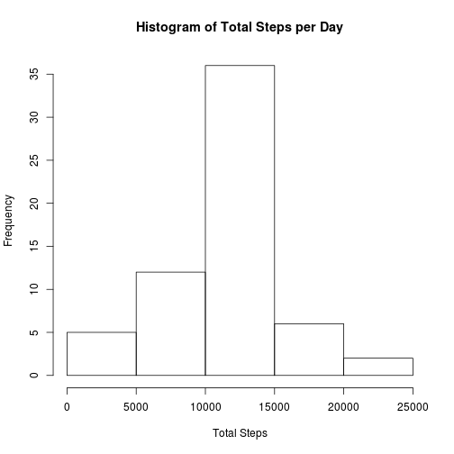
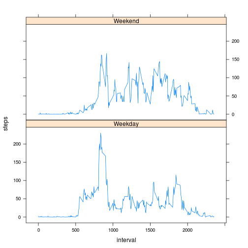

# Reproducible Research: Peer Assessment 1

Before we begin, we will make sure that the global options are set to echo the code.
Also, we load the libraries that are used later on.

```r
library(knitr)
library(lubridate)
library(lattice)
opts_chunk$set(echo=TRUE)
```

## Loading and preprocessing the data
The following code reads the activity.csv file into R. We are assuming that the 
data has already been extracted from the zip file, and the working directory has 
been set correctly.  
For now, no further processing of the data is needed.

```r
activity <- read.csv("activity.csv")
```

## What is mean total number of steps taken per day?
Next, we calculate the total number of steps taken each day, and create a histogram.  

```r
stepsPerDay <- aggregate(steps ~ date, activity, sum)
hist(stepsPerDay$steps, xlab = "Total Steps", main = "Histogram of Total Steps per Day")
```

 

Calculate the mean and median steps per day. Note that we are ignoring NA values.

```r
mean(stepsPerDay$steps)
```

```
## [1] 10766.19
```

```r
median(stepsPerDay$steps)
```

```
## [1] 10765
```

## What is the average daily activity pattern?
Calculate the mean steps per interval, across all days, and create a plot. We are using the lattice graphics 
package.

```r
meanPerInterval <- aggregate(steps ~ interval, data=activity, FUN=mean)
xyplot(steps~interval, data=meanPerInterval, main="Average Steps Per Time Interval", xlab="Interval", ylab="Steps", type="l")
```

 

Find the interval with the greatest number of steps, on average. Note that the 
time intervals are in the format "hhmm", so this gives an idea of the time of day
with the greatest number of steps.

```r
subset(meanPerInterval, steps==max(meanPerInterval$steps))
```

```
##     interval    steps
## 104      835 206.1698
```

## Inputing missing values
Calculate the total number of missing values:

```r
length(activity$steps[is.na(activity$steps)])
```

```
## [1] 2304
```

We will replace all the NA values with the average steps for each interval. 
To do this, we use the merge function to add new columns to the original dataframe that contain the average steps per interval.
Then, copy the average steps to the original steps field, just for those records where the original number of steps is NA.
Finally, remove the extra columns and reset the column names. The final result is a new dataframe called activityCompleteCases,
which is the same as the old dataframe but with the NA's replaced with the average for each interval.

```r
activityPlusMean <- merge(activity, meanPerInterval, by="interval")
activityPlusMean[is.na(activityPlusMean$steps.x), "steps.x"] <- activityPlusMean[is.na(activityPlusMean$steps.x), "steps.y"]
activityCompleteCases <- activityPlusMean[,c("interval","steps.x","date")]
names(activityCompleteCases) <- c("interval","steps","date")
```

As before, create a histogram of the total number of steps per day, and find the mean and median total steps per day.
The mean is exactly the same as before, but the median has increased slightly, and is now identical to the mean.
The histogram shows that adding missing values has caused the total number of steps to increase.

```r
stepsPerDayCC <- aggregate(steps ~ date, activityCompleteCases, sum)
hist(stepsPerDayCC$steps, xlab = "Total Steps", main = "Histogram of Total Steps per Day")
```

 

```r
mean(stepsPerDayCC$steps)
```

```
## [1] 10766.19
```

```r
median(stepsPerDayCC$steps)
```

```
## [1] 10766.19
```

## Are there differences in activity patterns between weekdays and weekends?
Use the weekdays() function and the date field to create a new factor variable with levels "Weekday" and "Weekend". To do this we use sapply to apply an anonymous function.

```r
weekend <- data.frame(sapply(weekdays(ymd(activityCompleteCases$date)), function(x) {if (x %in% c("Saturday","Sunday")) "Weekend" else "Weekday"} ) )
names(weekend) <- "WeekendOrWeekday"
activityCompleteCases <- cbind(activityCompleteCases,weekend)
means <- aggregate(steps~interval+ WeekendOrWeekday, activityCompleteCases, mean)
```

Create a time series plot that shows the mean for weekdays in one panel, and the mean for weekends in the other. The plot shows that weekdays have a peak in the morning. Weekends spread the steps out more evenly throughout the day, and unlike weekday mornings, no time interval has more than 200 steps.

```r
xyplot(steps ~ interval | WeekendOrWeekday, data=means, layout=c(1,2), type="l")
```

 
